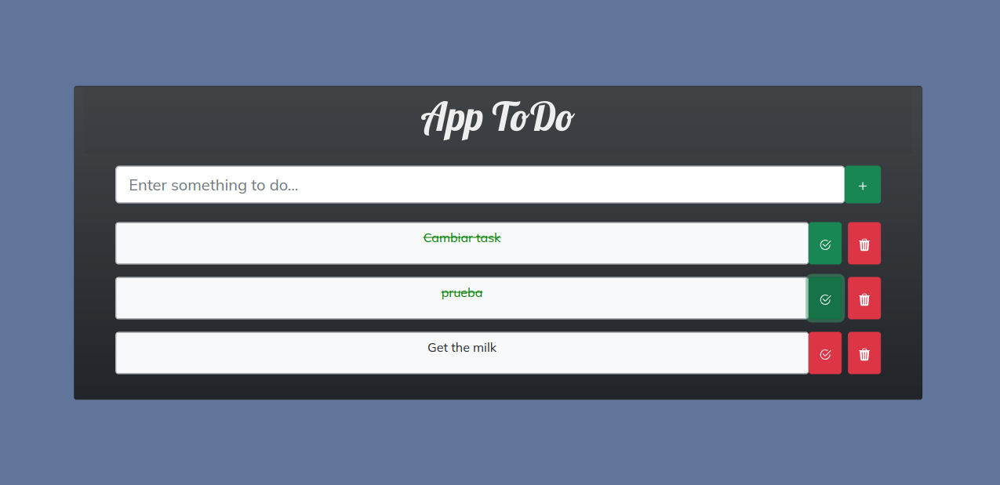

# React Todo App
A to-do list app made with React as front-end and Node, Express and MongoDB as back-end.

You can add, update, delete tasks.

## Enlace deploy application
https://app-todo-mongo-db-frontend.vercel.app/

## Mockups 

